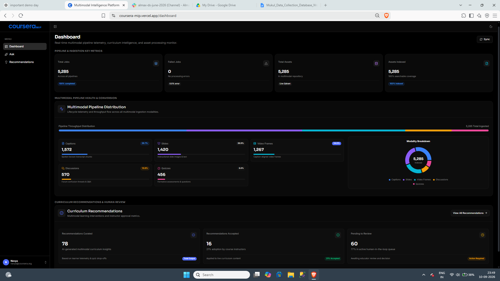
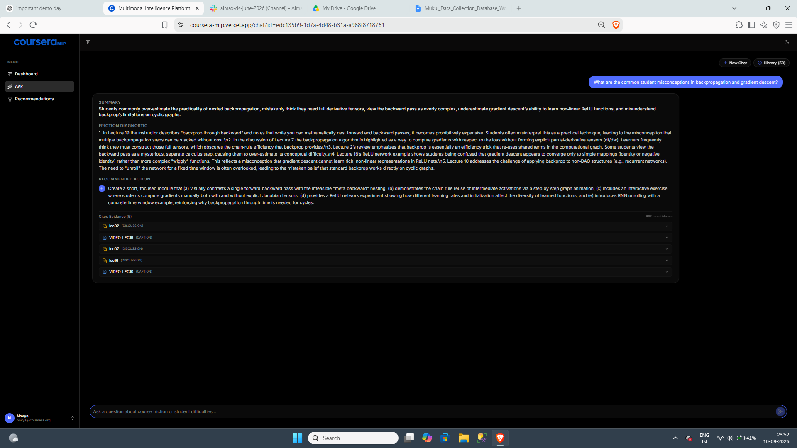
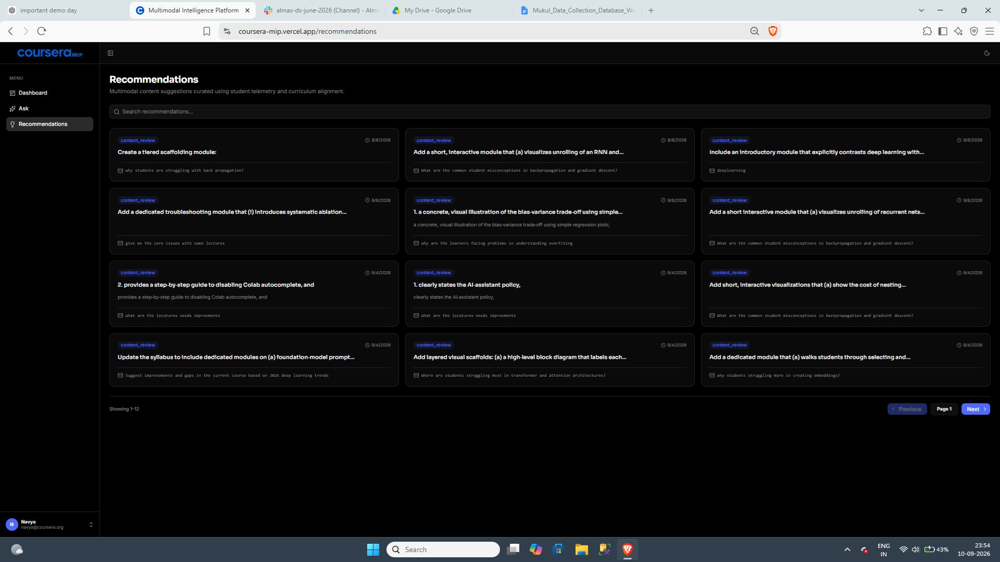
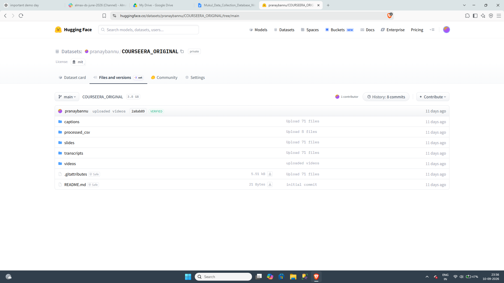
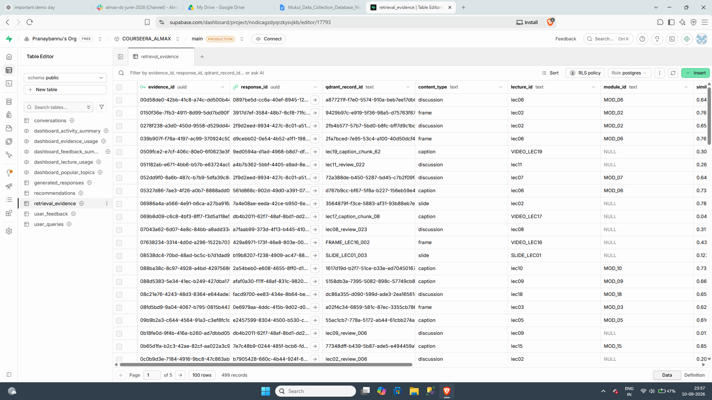
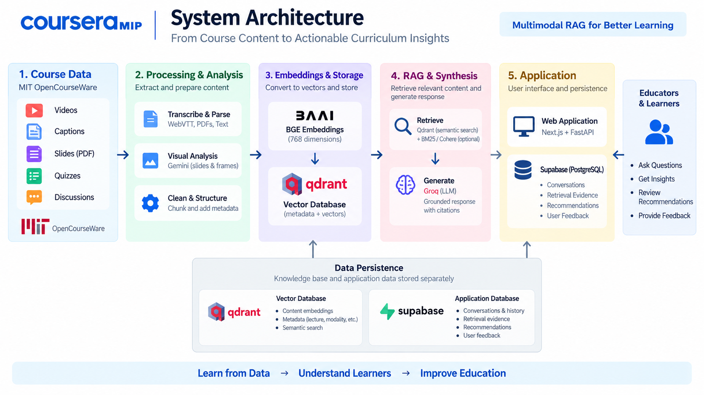

[](https://www.python.org/)
[](https://pandas.pydata.org/)
[](https://numpy.org/)
[](https://fastapi.tiangolo.com/)
[](https://www.langchain.com/)
[](https://qdrant.tech/)
[](https://supabase.com/)
[](https://huggingface.co/)
[](https://ai.google.dev/)
[](https://opencv.org/)
[](https://react.dev/)
[](https://nextjs.org/)
[](https://www.typescriptlang.org/)
[](https://tailwindcss.com/)
[](https://www.postgresql.org/)

# Coursera Multimodal Intelligence Platform (MIP)

## Individual Project Submission

This repository contains the complete Coursera Multimodal Intelligence Platform developed as a group project.

My primary contribution focused on the data and database layer of the system, including data collection and source validation, multimodal data structuring, embedding generation, Qdrant vector storage and ingestion, visual asset integration, and data validation.

---

## Project Overview

Coursera-MIP is an AI-powered curriculum analytics and multimodal diagnostic engine. It processes course videos, captions, slides, video frames, quizzes, and discussions into a unified retrieval system, synthesizes pedagogical friction diagnostics through LLM reasoning, and delivers a human-in-the-loop recommendation pipeline.

The system is designed not only to answer questions from course material, but also to identify learning friction, provide grounded evidence, and generate actionable curriculum recommendations.

---

## Key Features

- Multimodal course-content processing
- Caption, slide, frame, quiz, and discussion analysis
- Semantic vector retrieval using Qdrant
- Evidence-grounded RAG responses
- Curriculum friction diagnostics
- Cited retrieval evidence
- AI-generated curriculum recommendations
- Human-in-the-loop recommendation review
- Conversation history and application analytics
- Visual asset traceability
- Structured application data storage using Supabase

---

## Tech Stack by Module

### Frontend (`frontend/`)

- **Core**: Next.js 16 (App Router), React 19, TypeScript
- **Styling & UI**: Tailwind CSS v4, Shadcn UI, Radix / Base UI, Lucide Icons
- **State & Data Fetching**: TanStack React Query v5, Axios
- **Visualization**: Recharts
- **Forms & Feedback**: React Hook Form, React Hot Toast

### Backend (`backend/`)

- **API & Runtime**: FastAPI, Uvicorn, Python 3.10+
- **RAG & Orchestration**: LangChain, FastMCP (Model Context Protocol)
- **Vector Search & Reranking**: Qdrant, BM25 (`rank-bm25`), Cohere Rerank
- **LLM Reasoning & Output**: Groq, Instructor, Pydantic v2
- **Embeddings**: Sentence Transformers, Hugging Face Hub
- **Persistence**: Supabase (PostgreSQL)

### Database & Pipeline (`database/`)

- **Media Ingestion & Parsing**: OpenCV (video frames), PyMuPDF (slides & transcripts), WebVTT (captions)
- **Multimodal AI**: Google Gemini API (`google-genai`) for visual slide & frame analysis
- **Vector Ingestion**: Qdrant Client, Sentence Transformers (768-dimensional embeddings)
- **Relational Storage & Views**: Supabase (PostgreSQL schemas, views, and RLS policies)
- **Data Processing**: Pandas, NumPy, Pydantic

---

## Repository Structure

```text
coursera-mip/
├── backend/    # FastAPI server, RAG retrieval & synthesis pipeline, MCP server
├── database/   # Multimodal extraction, ingestion pipelines, and Supabase SQL
└── frontend/   # Next.js web application, diagnostic dashboard, and chat interface
```

---

# My Contribution

My contribution to the project focused primarily on the **data collection, multimodal processing, vector database, visual asset integration, and data validation layers**.

## 1. Data Collection & Source Validation

- Collected and validated course materials from **MIT OpenCourseWare**.
- Worked with raw course assets including:
  - Lecture videos
  - WebVTT captions
  - Transcript PDFs
  - Slide PDFs
  - Quiz data
  - Discussion data
- Structured the collected material for downstream processing and retrieval.
- Performed validation checks on source files and processed data before further ingestion.

## 2. Multimodal Data Structuring

Processed and organized five major content types:

- Captions
- Slides
- Video Frames
- Quizzes
- Discussions

Maintained shared identifiers such as:

- `course_id`
- `module_id`
- `lecture_id`

Established cross-modal relationships between different content types.

Examples include:

- Frames linked to captions using `primary_chunk_id`
- Quizzes linked to relevant caption chunks using `linked_chunk_ids`
- Discussions linked to relevant caption chunks using `linked_chunk_ids`

This structure supports traceability between retrieved content and the original course material.

## 3. Caption Processing

- Parsed WebVTT caption segments.
- Preserved source timestamps.
- Grouped related caption segments into meaningful chunks.
- Generated unique chunk identifiers.
- Stored metadata such as duration and word count.
- Prepared caption chunks for downstream embedding and retrieval.

## 4. Slide Processing & Visual Analysis

- Processed slide PDFs into individual slide images.
- Used PyMuPDF for PDF processing.
- Maintained slide-level metadata including lecture, slide number, image path, dimensions, and extraction status.
- Used Gemini for visual analysis of slides.
- Extracted information such as:
  - Slide summary
  - Visible text
  - Visual type
  - Diagram or graph explanation
  - Equations
  - Key concepts
  - Visual-text relationships
  - Instructional evidence
  - Review flags

## 5. Video Frame Extraction

- Selected representative video frames for caption chunks.
- Used the midpoint of each caption chunk to select a representative frame.
- Maintained the relationship between each frame and its source caption through `primary_chunk_id`.
- Used Gemini to generate textual analysis of representative frames.

This allowed visual information displayed during a lecture segment to remain connected with what the instructor was saying.

## 6. Embedding Generation

- Generated semantic embeddings using `BAAI/bge-base-en-v1.5`.
- Used **768-dimensional normalized embeddings**.
- Used **cosine similarity** for vector search.
- Prepared searchable text representations for each content type.
- Used Gemini-generated textual analysis as the searchable representation for visual content before embedding.
- Generated embeddings for captions, slides, frames, quizzes, and discussions.

## 7. Qdrant Vector Database & Ingestion

- Designed and populated the centralized Qdrant vector collection.
- Collection name:

`COURSEERA_ALMAX_MULTIMODAL`

- Vector dimension: **768**
- Distance metric: **Cosine similarity**
- Final indexed records: **5,285**

Contributed to:

- Vector ingestion pipeline
- Embedding dimension validation
- Record validation
- Deterministic point ID generation
- Batch upsert operations
- Metadata integration
- Content-type indexing
- Final point-count verification

Qdrant stores the vector representations and associated metadata required for semantic retrieval and traceability.

## 8. Visual Asset Integration

Integrated slide and video-frame assets with the private Hugging Face visual dataset.

### Visual Asset Distribution

- **1,420 slides**
- **1,267 video frames**
- **2,687 visual assets in total**

Maintained references between Qdrant records and their corresponding visual assets through metadata such as:

- `asset_provider`
- `asset_repo_id`
- `asset_repo_type`
- `asset_revision`
- `asset_path`
- `mime_type`

Visual binaries are stored separately while Qdrant maintains the references required to locate the corresponding assets.

## 9. Quiz & Discussion Data Processing

### Quiz Data

- Processed lecture chunks for topic extraction.
- Consolidated major lecture topics.
- Mapped chunks to approved topics.
- Generated and validated MCQ records.
- Maintained evidence chunk references for generated questions.
- Validated question fields, options, alignment, and question type.

### Discussion Data

- Generated structured learner discussion/review records grounded in lecture transcripts.
- Maintained source chunk IDs and timestamps.
- Validated generated records against authoritative transcript data.
- Performed validation and correction checks before final integration.

## 10. Data Validation & Traceability

- Validated processed records before vector ingestion.
- Verified embedding dimensions.
- Verified record identifiers.
- Checked content-type consistency.
- Validated visual asset mappings and database records.
- Verified Qdrant ingestion results.
- Maintained traceability between retrieved evidence and original course content.
- Preserved lecture, module, timestamp, and record-level metadata for evidence tracking.

---

## Multimodal Data Summary

| Content Type | Records |
|---|---:|
| Captions | 1,572 |
| Slides | 1,420 |
| Video Frames | 1,267 |
| Quizzes | 456 |
| Discussions | 570 |
| **Total** | **5,285** |

---

## System Architecture

The overall system connects course data collection, multimodal processing, embedding generation, vector retrieval, RAG synthesis, curriculum diagnostics, recommendations, and application persistence.

```text
MIT OpenCourseWare
        ↓
Raw Course Assets
        ↓
Data Extraction & Validation
        ↓
Captions | Slides | Frames | Quizzes | Discussions
        ↓
Multimodal Processing
        ↓
Gemini Visual Analysis
        ↓
BGE Embeddings
        ↓
Qdrant Vector Database
        ↓
Semantic Retrieval / Reranking
        ↓
RAG Synthesis
        ↓
Grounded Diagnostic & Evidence
        ↓
Curriculum Recommendations
        ↓
Supabase Application Database
```

---

## Data & Retrieval Flow

The data pipeline transforms raw course material into structured multimodal records that can be retrieved through semantic search.

```text
Raw Course Materials
        ↓
Extraction & Preprocessing
        ↓
Structured Multimodal Records
        ↓
Visual Analysis for Slides / Frames
        ↓
Embedding Generation
        ↓
Qdrant Vector Storage
        ↓
User Query
        ↓
Semantic Retrieval
        ↓
Optional BM25 / Cohere Reranking
        ↓
Retrieved Evidence
        ↓
LLM Synthesis
        ↓
Grounded Response
```

---

## Vector Database

The centralized Qdrant collection stores embeddings along with metadata required to identify and trace retrieved content.

### Configuration

- **Collection**: `COURSEERA_ALMAX_MULTIMODAL`
- **Embedding Model**: `BAAI/bge-base-en-v1.5`
- **Vector Dimension**: 768
- **Distance Metric**: Cosine similarity
- **Total Points**: 5,285

Qdrant stores vector representations and associated metadata. Visual assets are maintained separately and referenced through their asset paths and metadata.

---

## Application Database

Supabase PostgreSQL is used as the application database and is separate from the Qdrant course-content knowledge base.

The application layer maintains:

- Conversations
- User queries
- Generated responses
- Retrieval evidence
- Recommendations
- User feedback

The retrieval evidence layer stores references to the exact Qdrant records used during response generation, supporting evidence-level traceability.

---

## AI Workflow

The application follows a Retrieval-Augmented Generation workflow:

```text
User Query
    ↓
Query Embedding
    ↓
Qdrant Semantic Retrieval
    ↓
Optional BM25 / Cohere Reranking
    ↓
Retrieved Evidence
    ↓
LLM Synthesis
    ↓
Grounded Diagnostic
    ↓
Curriculum Recommendation
```

The retrieved evidence provides the grounding context for the generated response and allows the system to provide source-level citations.

---

## Screenshots

### Application Dashboard

The dashboard provides an overview of the multimodal processing pipeline, indexed assets, modality distribution, and recommendation activity.



### Multimodal RAG Query

The Ask interface retrieves relevant multimodal evidence and generates a grounded curriculum diagnostic with cited evidence.



### Curriculum Recommendations

The recommendation interface presents actionable curriculum improvements generated from retrieved evidence and supports human review through Accept and Reject actions.



### Qdrant Vector Database

The Qdrant collection contains the indexed multimodal records and metadata used for semantic retrieval.

### Hugging Face Visual Asset Repository



The project uses a private Hugging Face dataset to store the visual assets used by the multimodal pipeline.

- **Dataset:** `COURSEERA_ALMAX_VISUALS`
- **Visual Assets:** 2,687
- **Slides:** 1,420
- **Video Frames:** 1,267
- **Purpose:** Stores the actual visual assets referenced by Qdrant.

### Supabase Application Database

Supabase PostgreSQL stores application-level conversations, generated responses, retrieval evidence, recommendations, and feedback.



### System Architecture

The architecture diagram illustrates the complete flow from course data collection and multimodal processing to embeddings, vector retrieval, RAG synthesis, and application persistence.



---

## Project Video

[Watch the Project Demo Video](https://drive.google.com/file/d/13SWctYDT1XgK2wI2tzfLNROCpYlUjAtU/view?usp=sharing)

The demo video presents the end-to-end product workflow, including the application dashboard, multimodal RAG query, retrieved evidence, and curriculum recommendations.

---

## Live Project

[Open the Live Application](https://coursera-mip.vercel.app/)

---

## Relevant Artifacts

- **GitHub Repository:** This repository
- **Live Application:** [Coursera Multimodal Intelligence Platform](https://coursera-mip.vercel.app/)
- **Project Demo Video:** [Google Drive Video](https://drive.google.com/file/d/13SWctYDT1XgK2wI2tzfLNROCpYlUjAtU/view?usp=sharing)

---

## Evaluation & Reliability

The project includes validation and testing across the data and retrieval pipeline.

Key validation areas include:

- Source and input validation
- Content-type consistency checks
- Embedding dimension validation
- Record and identifier validation
- Visual asset path validation
- Qdrant ingestion verification
- Retrieval evidence traceability
- Backend API and RAG workflow testing

The final multimodal dataset contains 5,285 indexed records:

- 1,572 captions
- 1,420 slides
- 1,267 video frames
- 456 quizzes
- 570 discussions

---

## Security & API Key Protection

API keys and secrets are not included in the repository.

The application uses environment variables for sensitive credentials, including:

- `GEMINI_API_KEY`
- `QDRANT_API_KEY`
- `QDRANT_URL`
- `HF_TOKEN`
- `SUPABASE_URL`
- `SUPABASE_SECRET_KEY`

Sensitive `.env` files and credentials should remain local and must not be committed to the repository.

---

## Project Limitations

- The quality of generated diagnostics and recommendations depends on the quality and coverage of the retrieved course evidence.
- Visual understanding depends on the quality of the extracted slide and video-frame assets.
- External model and service availability can affect parts of the AI pipeline.
- The system is designed for curriculum analysis and recommendation support rather than replacing instructor judgment.

---

## Individual Contribution Summary

My primary responsibility was the **data and database layer**, covering the workflow from source collection and validation through multimodal structuring, embedding generation, Qdrant vector ingestion, visual asset integration, and retrieval traceability.

This work contributed to making the course content structured, searchable, traceable, and available to the downstream RAG and curriculum intelligence pipeline.

---

